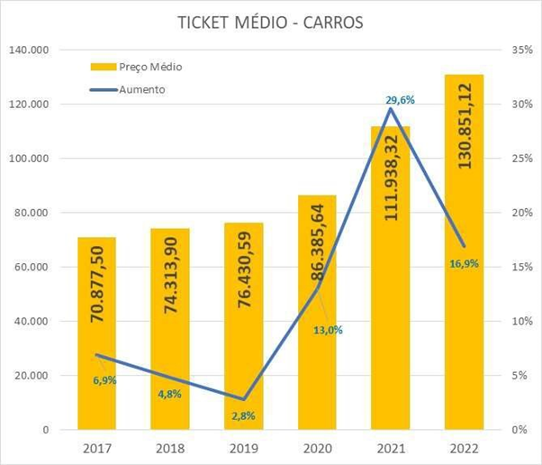
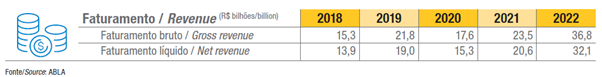

# Introdução

Ser proprietário de um veículo no Brasil se mostra uma tarefa cada vez mais proibitiva para grande parte da população. De acordo com um estudo (“Preço do carro novo no Brasil aumentou 90% em cinco anos”, 2023) realizado pela consultoria Jato Dynamics e publicada em 2023, o valor médio do carro novo aumentou cerca de 90% nos últimos cinco anos. No primeiro trimestre deste ano, o preço médio do carro já acumula alta de 7%.

  
- (Jato Dynamics/Divulgação)

No mundo pós pandemia do COVID-19 novos desafios foram lançados. A mobilidade passou por um processo de mudança onde muitas pessoas se viram na necessidade de abandonar o transporte coletivo e diversas empresas tiveram de terceirizar as suas frotas veiculares. Além disso, somado ao aumento do custo da cadeia produtiva, desvalorização da moeda brasileira e inflação em alta, o mercado de locação veiculares despontou como uma oportunidade de negócios (“Aumento das locações de veículos no Brasil”, 2023).

Segundo o anuário da Associação Brasileira das Locadoras de Automóveis (ABLA) publicado em 2023, o faturamento bruto das locadoras em 2022 subiu mais de 56% em relação a 2021, alcançando a marca de R$ 36,8 bilhões.
 
 

Conforme Quintella, diretor da FGV Transportes e editor-chefe da Revista Brasileira de Transportes (RBT), esses resultados permitem projeções otimistas para os próximos anos, colocando o mercado de locação de veículos em destaque.

Táticas para explorar a expansão desse mercado já estão em prática, como a adoção de carros na modalidade “carsharing”, onde o usuário pode usar o carro por períodos curtos, inferiores a uma diária e na modalidade por assinatura, onde o usuário fica com o veículo por um período longo (acima de trinta dias) mas não tem de se preocupar com despesas e burocracias como seguro, taxas, impostos e manutenção preventiva do veículo.

Estudos revelam que as empresas do setor de locadora de veículos devem fechar o ano com um crescimento de 30% em volume de veículos comprados, sendo responsáveis por 35% das vendas das montadoras além do número de empresas de locação de veículos terem saltado de 11.053 em 2020 para impressionantes 22.941 em 2022, aumento de mais de 107% (ABLA, 2023).

## Problema

O problema apresentado nesse projeto é a insatisfação dos clientes em relação às redes de locação de veículos devido a duas reclamações frequentes: a demora no processo de locação veicular e a falha no processamento dos dados do condutor, o que não apenas cria incômodos, mas também coloca em risco a segurança e a confiabilidade do serviço. Esses problemas afetam a experiência do cliente e podem prejudicar a qualidade e a reputação das redes de locação de veículos.

Ao analisarmos reclamações em um dos maiores portais de registro de queixas do Brasil, o Reclame Aqui (www.reclameaqui.com.br), observou-se que uma parcela significativa de clientes enfrenta problemas ao tentar retirar veículos alugados após reservas, devido a procedimentos burocráticos, constituindo mais de 40% das queixas contra as principais empresas do setor.  

## Objetivos

A aplicação "Carro na Mão", tem como objetivo dar maior eficiência no processo de locação e validação dos dados dos locatários de veículos, para que torne um processo mais ágil e transparente para cada cliente, sem comprometer a experiência de uso. 

> **Como objetivos específicos, podemos ressaltar:** 

> -Transparência, agilidade e modernidade; 

> -Permitir visualizar o bloqueio do usuário anteriormente a locação; 

> -Permitir locação segura que não gere problemas futuros para usuário com relação aos seus dados em nossa aplicação. 

## Justificativa

Devido ao aumento expressivo de competidores, para se estabelecer e usufruir do crescimento desse mercado, é essencial que se adotem ferramentas ágeis e eficazes para rápido acesso à contratação dos serviços de locação de veículos automotores, habilitando o cadastro do maior número de clientes, oferecendo: Acesso digital à frota disponível, preços, condições contratuais, reservas e suporte 24 horas.  

## Público-Alvo

O público-alvo de uma locadora de veículos é diversificado e abrange viajantes a lazer e a negócios, executivos, turistas, pessoas que necessitam de veículos temporários, clientes locais sem carro próprio, empresas em busca de soluções de transporte e entusiastas de aventuras. Essa variedade de perfis exige que a locadora ofereça opções de veículos, preços e serviços adaptados para atender às necessidades e preferências específicas de cada grupo.

## Referências

>[Link direto para listagem completa de referências](/docs/13-Referências.md)
