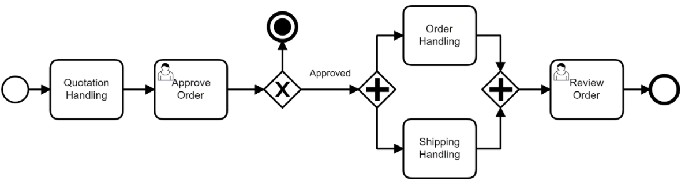

# Especificações do Projeto

Pré-requisitos: <a href="1-Documentação de Contexto.md"> Documentação de Contexto</a>

A definição do problema e dos pontos mais relevantes relacionados ao projeto foi realizada por meio de discussões entre os membros da equipe. Os pontos mais relevantes observados durante as discussões foram então consolidados na por meio da elaboração de personas e histórias de usuário, que são mostradas nas seções a seguir.

## Personas

|Lucas      | Informações:                       |                                        |
|--------------------|------------------------------------|----------------------------------------|
|  | **Idade:** 32   **Ocupação:** Executivo de Vendas   **Uso do Cartão de Credito:** Utiliza um cartão corporativo fornecido pela empresa.   **Opinião sobre Aplicação Financeira:** Lucas valoriza uma aplicação que possa ajudá-lo a monitorar os gastos de suas viagens de negócios, incluindo as despesas com locação de veículos.  |**Aplicativos:** ● Whatsapp  ● Instagram ● Facebook  |
|**Motivações:** ● Eficiência em viagens de negócios  ●  Prestação de contas simplificada |**Frustrações:** ● Atrasos em locações de carros   ● Processos de reembolso complicados |**Hobbies:** ● Jogar Tênis ● Explorar novos restaurantes  ● Ler |

\
\
\
|Sofia      | Informações:                       |                                        |
|--------------------|------------------------------------|----------------------------------------|
|   | **Idade:** 28   **Profissão:** Designer Gráfica   **Uso do Cartão de Crédito:** Utiliza seu cartão pessoal para transações.   **Opinião sobre Aplicação Financeira:** Sofia gosta da ideia de uma aplicação financeira que possa ajudá-la a rastrear os gastos de suas viagens, incluindo os custos de locação de carros.  |**Aplicativos:** ● Instagram  ● Google Maps ● Airbnb  |
|**Motivações:** ● Experiências autênticas em viagens  ● Itinerários flexíveis |**Frustrações:** ● Filas longas em locadoras  ● Falta de orientação em destinos desconhecidos |**Hobbies:** ● Fotografia ● Aulas de culinária  ● Praticar Ioga |

|André      | Informações:                       |                                        |
|--------------------|------------------------------------|----------------------------------------|
|  | **Idade:** 40   **Profissão:** Empresário   **Uso do Cartão de Crédito:** Utiliza seu cartão pessoal para transações.   **Opinião sobre Aplicação Financeira:** André vê valor em uma aplicação financeira que o ajude a acompanhar os gastos com locação de carros, além de outras despesas.  |**Aplicativos:** ● WhatsApp  ● Waze ● IFood  |
|**Motivações:** ● Acesso fácil a veículos temporários  ● Conveniência |**Frustrações:** ● Bloqueios indevidos em locações  ● Custos inesperados |**Hobbies:** ● Correr ● Jardinagem  ● Assistir a filmes de comédia |

|Marina      | Informações:                       |                                        |
|--------------------|------------------------------------|----------------------------------------|
|  | **Idade:** 25   **Profissão:** Aventureira e Blogueira de Viagens   **Uso do Cartão de Crédito:** Utiliza seu cartão pessoal para transações.   **Opinião sobre Aplicação Financeira:** Marina vê a aplicação financeira como uma ferramenta útil para monitorar seus gastos em suas aventuras, incluindo as locações de carros.  |**Aplicativos:** ● AllTrails  ● Instagram ● Spotify  |
|**Motivações:** ● Veículos adequados para aventuras  ● Facilidade em planejar expedições |**Frustrações:** ● Falta de veículos 4x4  ● Dificuldade em encontrar trilhas seguras |**Hobbies:** ● Escalada  ● Acampamento ● Fotografia de natureza |

|Renata      | Informações:                       |                                        |
|--------------------|------------------------------------|----------------------------------------|
|  | **Idade:** 38   **Profissão:** Gerente de Recursos Humanos   **Uso do Cartão de Crédito:** Utiliza um cartão corporativo fornecido pela empresa.   **Opinião sobre Aplicação Financeira:** Renata vê grande utilidade em uma aplicação financeira que possa ajudá-la a rastrear os gastos da conferência corporativa, incluindo as locações de carros.  |**Aplicativos:** • Microsoft Teams  • MegaConcursos • SeuRH |
|**Motivações:** ● Soluções eficientes para eventos corporativos  ● Controle de gastos |**Frustrações:** ● Atrasos na entrega de veículos  ● Problemas de faturamento |**Hobbies:** • Leitura de negócios • Networking  • Culinária gourmet |

|Rodrigo     | Informações:                       |                                        |
|--------------------|------------------------------------|----------------------------------------|
|  | **Idade:** 45   **Cargo:** CEO de uma Empresa de Locação   **Uso do Cartão de Crédito:** Utiliza um cartão corporativo fornecido pela empresa.   **Necessidade:** Melhorar a eficiência operacional e a experiência do cliente em sua locadora.  |**Aplicativos:** • Slack  • Trello • Bloomberg |
|**Motivações:** ● Melhorar eficiência operacional  ● Aumentar a fidelidade do cliente |**Frustrações:** ● Processos manuais demorados  ● Feedback negativo dos clientes |**Hobbies:** • Golfe • Ler sobre gestão  • Assistir a documentários de negócios |

|Camila      | Informações:                       |                                        |
|--------------------|------------------------------------|----------------------------------------|
|  | **Idade:** 38   **Cargo:** Gerente de Frota de uma Locadora   **Uso do Cartão de Crédito:** Utiliza um cartão corporativo fornecido pela empresa.   **Necessidade:** Manter um controle eficiente da frota e monitorar a utilização dos veículos.  |**Aplicativos:** • Asana  • Fleet Complete • Spotify |
|**Motivações:** ● Gestão eficaz da frota  ● Manutenção preventiva |**Frustrações:** ● Falta de informações sobre uso dos veículos  ● Manutenções não agendadas |**Hobbies:** • Passeios de bicicleta • Fotografia de natureza  • Ouvir podcasts sobre logística |

|Andréia     | Informações:                       |                                        |
|--------------------|------------------------------------|----------------------------------------|
|  | **Idade:** 30   **Cargo:** Analista de Dados em uma Empresa de Locação   **Uso do Cartão de Crédito:** Não utiliza cartão geralmente.   **Necessidade:** Coletar e analisar dados para tomar decisões estratégicas na locadora.  |**Aplicativos:** • Tableau  • Slack • Coursera |
|**Motivações:** ● Análises precisas para tomada de decisões estratégicas. |**Frustrações:** ● Dificuldades em obter dados confiáveis,  falta de ferramentas de visualização. |**Hobbies:** • Jogar xadrez online • Aprender sobre aprendizado de máquina  • Cozinhar pratos étnicos |

|Eduardo     | Informações:                       |                                        |
|--------------------|------------------------------------|----------------------------------------|
|  | **Idade:** 50   **Cargo:** Diretor de Operações em Locadoras   **Uso do Cartão de Crédito:** Utiliza um cartão corporativo fornecido pela empresa.   **Necessidade:** Implementar melhorias operacionais na organização.  |**Aplicativos:** • LinkedIn  • Microsoft Teams • Evernote |
|**Motivações:** ● Padronização de operações em várias filiais  ● Eficiência. |**Frustrações:** ● Falta de cooperação entre as filiais  ● Problemas constantes de qualidade. |**Hobbies:** • Praticar Peteca • Ler sobre inovações em gestão  • Assistir a documentários históricos |

## Histórias de Usuários

A partir da análise das personas elaboradas, foram levantadas as histórias de usuários mostradas abaixo:

|EU COMO... `PERSONA`| QUERO/PRECISO ... `FUNCIONALIDADE` |PARA ... `MOTIVO/VALOR`                 |
|--------------------|------------------------------------|----------------------------------------|
|Lucas  | Alugar um carro rapidamente para viagem de negócios.  | Agilidade é essencial para cumprir compromissos profissionais. |
|Sofia  | Alugar um carro conveniente para explorar uma nova cidade durante as férias.  | Deseja liberdade de locomoção e flexibilidade em sua viagem. |
|Sofia  | Encontrar um veículo espaçoso para viagem com amigos, sem comprometer o orçamento.  | Busca conforto e economia ao viajar com companhia. |
|André  | Alugar um carro para uma ocasião especial, como um encontro romântico, e impressionar sua parceira.  | Quer criar uma experiência memorável. |
|Marina  | Alugar um veículo confortável e seguro para uma viagem em família ao campo.  | Deseja garantir a segurança e o conforto de sua família. |
|Renata  | Alugar vários carros para uma conferência corporativa.  | Necessita de uma frota para atender às demandas do evento. |
|Renata  | Encontrar soluções de locação flexíveis para a equipe que participará de uma conferência.  | Busca praticidade e conforto para seus colaboradores. |
|Rodrigo  | Aprimorar eficiência operacional e experiência do cliente na locadora.  | Deseja otimizar processos e melhorar a satisfação do cliente para impulsionar os negócios. |
|Rodrigo  | Implementar um sistema de cadastro mais preciso para evitar frustrações dos clientes e melhorar a reputação da locadora.  | Busca construir uma imagem positiva da empresa. |
|Camila  | Manter controle eficiente da frota e monitorar a utilização dos veículos.  | Quer garantir que os veículos estejam sendo usados de maneira eficaz e bem cuidados. |
|Andréia  | Criar painéis de visualização personalizados para analisar as tendências de locação, permitindo uma abordagem mais direcionada nas estratégias de marketing.  | Deseja melhorar a eficácia das campanhas promocionais. |
|Eduardo  | Implementar melhorias operacionais na organização.  | Precisa padronizar processos e garantir alta qualidade em todas as operações da organização. |

## Modelagem do Processo de Negócio 

### Análise da Situação Atual

Apresente aqui os problemas existentes que viabilizam sua proposta. Apresente o modelo do sistema como ele funciona hoje. Caso sua proposta seja inovadora e não existam processos claramente definidos, apresente como as tarefas que o seu sistema pretende implementar são executadas atualmente, mesmo que não se utilize tecnologia computacional. 

### Descrição Geral da Proposta

Apresente aqui uma descrição da sua proposta abordando seus limites e suas ligações com as estratégias e objetivos do negócio. Apresente aqui as oportunidades de melhorias.

### Processo 1 – NOME DO PROCESSO

Apresente aqui o nome e as oportunidades de melhorias para o processo 1. Em seguida, apresente o modelo do processo 1, descrito no padrão BPMN. 

### Processo 2 – NOME DO PROCESSO

Apresente aqui o nome e as oportunidades de melhorias para o processo 2. Em seguida, apresente o modelo do processo 2, descrito no padrão BPMN.

## Indicadores de Desempenho

Apresente aqui os principais indicadores de desempenho e algumas metas para o processo. Atenção: as informações necessárias para gerar os indicadores devem estar contempladas no diagrama de classe. Colocar no mínimo 5 indicadores. 

Usar o seguinte modelo: 

Obs.: todas as informações para gerar os indicadores devem estar no diagrama de classe a ser apresentado a posteriori. 

## Requisitos

As tabelas que se seguem apresentam os requisitos funcionais e não funcionais que detalham o escopo do projeto. Para determinar a prioridade de requisitos, aplicar uma técnica de priorização de requisitos e detalhar como a técnica foi aplicada.

### Requisitos Funcionais

|ID    | Descrição do Requisito  | Prioridade |
|------|-----------------------------------------|----|
|RF-001| Permitir que o usuário cadastre tarefas | ALTA | 
|RF-002| Emitir um relatório de tarefas no mês   | MÉDIA |

### Requisitos não Funcionais

|ID     | Descrição do Requisito  |Prioridade |
|-------|-------------------------|----|
|RNF-001| O sistema deve ser responsivo para rodar em um dispositivos móvel | MÉDIA | 
|RNF-002| Deve processar requisições do usuário em no máximo 3s |  BAIXA | 

Com base nas Histórias de Usuário, enumere os requisitos da sua solução. Classifique esses requisitos em dois grupos:

- [Requisitos Funcionais
 (RF)](https://pt.wikipedia.org/wiki/Requisito_funcional):
 correspondem a uma funcionalidade que deve estar presente na
  plataforma (ex: cadastro de usuário).
- [Requisitos Não Funcionais
  (RNF)](https://pt.wikipedia.org/wiki/Requisito_n%C3%A3o_funcional):
  correspondem a uma característica técnica, seja de usabilidade,
  desempenho, confiabilidade, segurança ou outro (ex: suporte a
  dispositivos iOS e Android).
Lembre-se que cada requisito deve corresponder à uma e somente uma
característica alvo da sua solução. Além disso, certifique-se de que
todos os aspectos capturados nas Histórias de Usuário foram cobertos.

## Restrições

O projeto está restrito pelos itens apresentados na tabela a seguir.

|ID| Restrição                                             |
|--|-------------------------------------------------------|
|01| O projeto deverá ser entregue até o final do semestre |
|02| Não pode ser desenvolvido um módulo de backend        |

Enumere as restrições à sua solução. Lembre-se de que as restrições geralmente limitam a solução candidata.

> **Links Úteis**:
> - [O que são Requisitos Funcionais e Requisitos Não Funcionais?](https://codificar.com.br/requisitos-funcionais-nao-funcionais/)
> - [O que são requisitos funcionais e requisitos não funcionais?](https://analisederequisitos.com.br/requisitos-funcionais-e-requisitos-nao-funcionais-o-que-sao/)

## Diagrama de Casos de Uso

O diagrama de casos de uso é o próximo passo após a elicitação de requisitos, que utiliza um modelo gráfico e uma tabela com as descrições sucintas dos casos de uso e dos atores. Ele contempla a fronteira do sistema e o detalhamento dos requisitos funcionais com a indicação dos atores, casos de uso e seus relacionamentos. 

As referências abaixo irão auxiliá-lo na geração do artefato “Diagrama de Casos de Uso”.

> **Links Úteis**:
> - [Criando Casos de Uso](https://www.ibm.com/docs/pt-br/elm/6.0?topic=requirements-creating-use-cases)
> - [Como Criar Diagrama de Caso de Uso: Tutorial Passo a Passo](https://gitmind.com/pt/fazer-diagrama-de-caso-uso.html/)
> - [Lucidchart](https://www.lucidchart.com/)
> - [Astah](https://astah.net/)
> - [Diagrams](https://app.diagrams.net/)

# Matriz de Rastreabilidade

A matriz de rastreabilidade é uma ferramenta usada para facilitar a visualização dos relacionamento entre requisitos e outros artefatos ou objetos, permitindo a rastreabilidade entre os requisitos e os objetivos de negócio. 

A matriz deve contemplar todos os elementos relevantes que fazem parte do sistema, conforme a figura meramente ilustrativa apresentada a seguir.

> **Links Úteis**:
> - [Artigo Engenharia de Software 13 - Rastreabilidade](https://www.devmedia.com.br/artigo-engenharia-de-software-13-rastreabilidade/12822/)
> - [Verificação da rastreabilidade de requisitos usando a integração do IBM Rational RequisitePro e do IBM ClearQuest Test Manager](https://developer.ibm.com/br/tutorials/requirementstraceabilityverificationusingrrpandcctm/)
> - [IBM Engineering Lifecycle Optimization – Publishing](https://www.ibm.com/br-pt/products/engineering-lifecycle-optimization/publishing/)

# Gerenciamento de Projeto

De acordo com o PMBoK v6 as dez áreas que constituem os pilares para gerenciar projetos, e que caracterizam a multidisciplinaridade envolvida, são: Integração, Escopo, Cronograma (Tempo), Custos, Qualidade, Recursos, Comunicações, Riscos, Aquisições, Partes Interessadas. Para desenvolver projetos um profissional deve se preocupar em gerenciar todas essas dez áreas. Elas se complementam e se relacionam, de tal forma que não se deve apenas examinar uma área de forma estanque. É preciso considerar, por exemplo, que as áreas de Escopo, Cronograma e Custos estão muito relacionadas. Assim, se eu amplio o escopo de um projeto eu posso afetar seu cronograma e seus custos.

## Gerenciamento de Tempo

Com diagramas bem organizados que permitem gerenciar o tempo nos projetos, o gerente de projetos agenda e coordena tarefas dentro de um projeto para estimar o tempo necessário de conclusão.

O gráfico de Gantt ou diagrama de Gantt também é uma ferramenta visual utilizada para controlar e gerenciar o cronograma de atividades de um projeto. Com ele, é possível listar tudo que precisa ser feito para colocar o projeto em prática, dividir em atividades e estimar o tempo necessário para executá-las. A imagem a seguir e uma representação de como  ficara dividido as etapas do nosso projeto nesse semestre 

Para gerir o projeto de uma maneira eficaz, iremos utilizar a ferramenta trello. Pois a mesma nos permite criar alertas de quando tempo falta para terminar cada tarefa, quem será o responsável por executar a Task e categorizar as atividades. Abaixo a imagem de como está atualmente o trello da equipe. 

## Gerenciamento de Equipe

O gerenciamento adequado de tarefas contribuirá para que o projeto alcance altos níveis de produtividade. Por isso, é fundamental que ocorra a gestão de tarefas e de pessoas, de modo que os times envolvidos no projeto possam ser facilmente gerenciados. 

## Gestão de Orçamento

Os valores dos custos do projeto foram calculados com a estimativa de tempo de quatro meses, utilizando sete profissionais. Qualquer alteração de custos que ultrapassar a estimativa da linha de base deverá ser avaliada pelo cliente e gerente do projeto. 

|Recursos Necessários| Valor      |
|-----------------|---------------|
|Recursos Humanos | R$ 116.480,00 |
|Software         | R$ 1.008,00   |
|Serviços         | R$ 2.240,00   |
|Total            | R$ 119.728,00 |

Cálculo: 

Recursos Humanos = 7 Profissionais x R$ 40,00/hora x 416 horas (4 meses) = R$ 116.480,00 

Softwares = 7 locações (office + windows) x R$ 36,00/Mês x 4 Meses = R$ 1.008,00 

Serviços = 7 despesas (energia + hospedagem) x R$ 80,00/Mês x 4 Meses = R$ 2.240,00 
