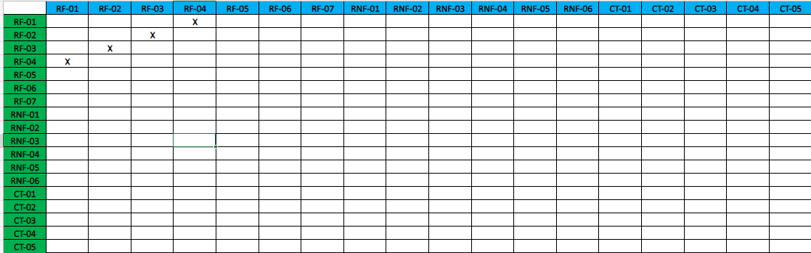

# Especificações do Projeto

Pré-requisitos: <a href="1-Documentação de Contexto.md"> Documentação de Contexto</a>

A definição do problema e dos pontos mais relevantes relacionados ao projeto foi realizada por meio de discussões entre os membros da equipe. Os pontos mais relevantes observados durante as discussões foram então consolidados na por meio da elaboração de personas e histórias de usuário, que são mostradas nas seções a seguir.

## Personas

|Lucas      | Informações:                       |                                        |
|--------------------|------------------------------------|----------------------------------------|
|  | **Idade:** 32   **Ocupação:** Executivo de Vendas   **Uso do Cartão de Credito:** Utiliza um cartão corporativo fornecido pela empresa.   **Opinião sobre Aplicação Financeira:** Lucas valoriza uma aplicação que possa ajudá-lo a monitorar os gastos de suas viagens de negócios, incluindo as despesas com locação de veículos.  |**Aplicativos:** ● Whatsapp  ● Instagram ● Facebook  |
|**Motivações:** ● Eficiência em viagens de negócios  ●  Prestação de contas simplificada |**Frustrações:** ● Atrasos em locações de carros   ● Processos de reembolso complicados |**Hobbies:** ● Jogar Tênis ● Explorar novos restaurantes  ● Ler |

|André      | Informações:                       |                                        |
|--------------------|------------------------------------|----------------------------------------|
|  | **Idade:** 40   **Profissão:** Empresário   **Uso do Cartão de Crédito:** Utiliza seu cartão pessoal para transações.   **Opinião sobre Aplicação Financeira:** André vê valor em uma aplicação financeira que o ajude a acompanhar os gastos com locação de carros, além de outras despesas.  |**Aplicativos:** ● WhatsApp  ● Waze ● IFood  |
|**Motivações:** ● Acesso fácil a veículos temporários  ● Conveniência |**Frustrações:** ● Bloqueios indevidos em locações  ● Custos inesperados |**Hobbies:** ● Correr ● Jardinagem  ● Assistir a filmes de comédia |

|Marina      | Informações:                       |                                        |
|--------------------|------------------------------------|----------------------------------------|
|  | **Idade:** 25   **Profissão:** Aventureira e Blogueira de Viagens   **Uso do Cartão de Crédito:** Utiliza seu cartão pessoal para transações.   **Opinião sobre Aplicação Financeira:** Marina vê a aplicação financeira como uma ferramenta útil para monitorar seus gastos em suas aventuras, incluindo as locações de carros.  |**Aplicativos:** ● AllTrails  ● Instagram ● Spotify  |
|**Motivações:** ● Veículos adequados para aventuras  ● Facilidade em planejar expedições |**Frustrações:** ● Falta de veículos 4x4  ● Dificuldade em encontrar trilhas seguras |**Hobbies:** ● Escalada  ● Acampamento ● Fotografia de natureza |

|Renata      | Informações:                       |                                        |
|--------------------|------------------------------------|----------------------------------------|
|  | **Idade:** 38   **Profissão:** Gerente de Recursos Humanos   **Uso do Cartão de Crédito:** Utiliza um cartão corporativo fornecido pela empresa.   **Opinião sobre Aplicação Financeira:** Renata vê grande utilidade em uma aplicação financeira que possa ajudá-la a rastrear os gastos da conferência corporativa, incluindo as locações de carros.  |**Aplicativos:** • Microsoft Teams  • MegaConcursos • SeuRH |
|**Motivações:** ● Soluções eficientes para eventos corporativos  ● Controle de gastos |**Frustrações:** ● Atrasos na entrega de veículos  ● Problemas de faturamento |**Hobbies:** • Leitura de negócios • Networking  • Culinária gourmet |

|Rodrigo     | Informações:                       |                                        |
|--------------------|------------------------------------|----------------------------------------|
|  | **Idade:** 45   **Cargo:** CEO de uma Empresa de Locação   **Uso do Cartão de Crédito:** Utiliza um cartão corporativo fornecido pela empresa.   **Necessidade:** Melhorar a eficiência operacional e a experiência do cliente em sua locadora.  |**Aplicativos:** • Slack  • Trello • Bloomberg |
|**Motivações:** ● Melhorar eficiência operacional  ● Aumentar a fidelidade do cliente |**Frustrações:** ● Processos manuais demorados  ● Feedback negativo dos clientes |**Hobbies:** • Golfe • Ler sobre gestão  • Assistir a documentários de negócios |

|Andréia     | Informações:                       |                                        |
|--------------------|------------------------------------|----------------------------------------|
|  | **Idade:** 30   **Cargo:** Analista de Dados em uma Empresa de Locação   **Uso do Cartão de Crédito:** Não utiliza cartão geralmente.   **Necessidade:** Coletar e analisar dados para tomar decisões estratégicas na locadora.  |**Aplicativos:** • Tableau  • Slack • Coursera |
|**Motivações:** ● Análises precisas para tomada de decisões estratégicas. |**Frustrações:** ● Dificuldades em obter dados confiáveis,  falta de ferramentas de visualização. |**Hobbies:** • Jogar xadrez online • Aprender sobre aprendizado de máquina  • Cozinhar pratos étnicos |

|Eduardo     | Informações:                       |                                        |
|--------------------|------------------------------------|----------------------------------------|
|  | **Idade:** 50   **Cargo:** Lider de Operações em Locadoras   **Uso do Cartão de Crédito:** Utiliza um cartão corporativo fornecido pela empresa.   **Necessidade:** Implementar melhorias operacionais na organização.  |**Aplicativos:** • LinkedIn  • Microsoft Teams • Evernote |
|**Motivações:** ● Padronização de operações em várias filiais  ● Eficiência. |**Frustrações:** ● Falta de cooperação entre as filiais  ● Problemas constantes de qualidade. |**Hobbies:** • Praticar Peteca • Ler sobre inovações em gestão  • Assistir a documentários históricos |

|Gustavo    | Informações:                       |                                        |
|--------------------|------------------------------------|----------------------------------------|
|  | **Idade:** 35   **Cargo:** Assistente Administrativo em uma locadora   **Uso do Cartão de Crédito:** Utiliza seu cartão pessoal para transações.  **Necessidade:** Implementar melhorias operacionais na organização.  |**Aplicativos:** • Waze  • Linkedin • Trello |
|**Motivações:** ● Gerenciamento eficiente de gastos profissionais  ● Registro simplificado de despesas  ● Eficiência. |**Frustrações:** ●  Esquecimento de despesas   ● Falta de categorização dos gastos |**Hobbies:** • Andar de bicicleta • Assistir a documentários  • Culinária |

## Histórias de Usuários

A partir da análise das personas elaboradas, foram levantadas as histórias de usuários mostradas abaixo:

|EU COMO... `PERSONA`| QUERO/PRECISO ... `FUNCIONALIDADE` |PARA ... `MOTIVO/VALOR`                 |
|--------------------|------------------------------------|----------------------------------------|
|Lucas  | Avaliar o serviço da locadora após a viagem.  | Compartilhar sua experiência e contribuir para a melhoria contínua dos serviços. |
|Lucas  | Escolher um carro para alugar com base em preço, modelo, data e local de retirada. | Encontrar a opção mais adequada para suas necessidades de viagem. |
|André  | Alugar um carro para uma ocasião especial, como um encontro romântico, e impressionar sua parceira.  | Quer criar uma experiência memorável. |
|Marina  | Visualizar o histórico de locações realizadas e agendadas.  | Deseja garantir a segurança e controle das locações realizadas, bem como gastos empenhados em locações |
|Marina  | Visualizar um mapa indicando o local onde devo retirar meu veículo locado. | Encontrar o local de retirada de forma conveniente. |
|Renata  | Receber notificações sobre datas de aluguel e pagamentos pendentes.  | Manter-se informada e evitar atrasos em pagamentos. |
|Renata  | Encontrar soluções de locação flexíveis para a equipe que participará de uma conferência.  | Busca praticidade e conforto para seus colaboradores. |
|Rodrigo  | Implementar um sistema de cadastro mais preciso para evitar frustrações dos clientes e melhorar a reputação da locadora.  | Busca construir uma imagem positiva da empresa. |
|Andréia  | Criar painéis de visualização personalizados para analisar as tendências de locação, permitindo uma abordagem mais direcionada nas estratégias de marketing.  | Deseja melhorar a eficácia das campanhas promocionais. |
|Eduardo  | Cadastrar os veiculos, categorias e valores das diarias  | Precisa padronizar processos e informações para garantir alta qualidade em todas as operações da organização. |
|Andreia| Validar se há bloqueios na conta do cliente no cadastro interno e não permitir locações em caso de impedimentos. | Garantir a segurança e a conformidade das locações. |
|Gustavo| Registrar infrações de trânsito para identificação do condutor infrator. | Cumprir com responsabilidades legais e identificar responsáveis por infrações. |
|Gustavo| Registrar manutenções e quilometragens do veículo durante o tempo ativo na frota. | Manter o histórico de manutenções e controlar a quilometragem para manter os veículos em bom estado. |
|Gustavo|Documentar vistorias na retirada e entrega dos veículos aos clientes |Garantir registros precisos das condições dos veículos para evitar disputas futuras. |

## Modelagem do Processo de Negócio 

### Análise da Situação Atual
Na atualidade, os procedimentos relativos à locação de veículos englobam a interação do cliente com o site da locadora ou por intermédio do aplicativo correspondente, através dos quais é conferida a possibilidade de selecionar a categoria desejada do veículo. Uma vez dentro do ambiente virtual, é possível examinar a lista dos veículos disponíveis nessa categoria, procedendo, posteriormente, à fixação da data e horário desejados para a retirada do automóvel.

Não obstante, constata-se uma ampliação apreciável no volume de reclamações reportadas pelos clientes que, ao se apresentarem no horário preestabelecido para a retirada do veículo, se deparam, no momento da efetivação, com contratempos pendentes. Estes impedem a liberação do veículo previamente reservado.

Tais pendências, de maneira recorrente, têm sua origem na demora no processo de verificação documental do locatário e na insuficiência da disponibilidade de veículos, além de outros fatores afins. Este cenário não apenas culmina em ônus adicionais suportados pelos clientes, que se veem compelidos a se deslocarem até a base da locadora, mas também suscita a possibilidade de prejudicar os planos e cronogramas tanto das empresas envolvidas quanto dos clientes individuais que fundamentavam suas expectativas na locação do veículo.

### Descrição Geral da Proposta

Apresentamos uma abordagem centrada no cliente, visando aprimorar a interação tanto na plataforma web quanto no aplicativo. Nossa proposta inclui:

Disponibilizar uma ampla gama de categorias de veículos para atender diversas necessidades dos clientes.

Reduzir possíveis atrasos na locação através da verificação prévia de disponibilidade e pendências.

Oferecer a opção de contato direto com um atendente, garantindo assistência imediata conforme necessário.

Minimizar bloqueios indevidos em locações e evitar custos inesperados.

Facilitar o processo de pagamento ao gerar cálculos precisos das diárias.

Incorporar um atalho de navegação para o local de retirada ou devolução do veículo, simplificando o percurso.

Para as locadoras, nossa proposta envolve:

Realizar a validação dos documentos durante o cadastro, reforçando essa validação no momento da reserva.

Promover feedback por meio das avaliações dos usuários, permitindo aprimoramentos contínuos em nossos serviços.

Estabelecer um controle otimizado para localização de veículos em filiais e matrizes.

Implementar checklists tanto no check-in quanto no check-out, garantindo maior rigor na inspeção dos veículos e suas condições.

Estamos comprometidos em proporcionar uma experiência mais eficaz e confiável para nossos clientes, ao mesmo tempo em que otimizamos nossos processos internos para melhor atender às demandas das locadoras. Seu conforto e satisfação são nossa prioridade, e continuaremos a buscar maneiras de aprimorar nossos serviços.

### Processo 1 – NOME DO PROCESSO

Apresente aqui o nome e as oportunidades de melhorias para o processo 1. Em seguida, apresente o modelo do processo 1, descrito no padrão BPMN. 

()

### Processo 2 – NOME DO PROCESSO

Apresente aqui o nome e as oportunidades de melhorias para o processo 2. Em seguida, apresente o modelo do processo 2, descrito no padrão BPMN.

(img/carro2.png)

## Indicadores de Desempenho

Apresente aqui os principais indicadores de desempenho e algumas metas para o processo. Atenção: as informações necessárias para gerar os indicadores devem estar contempladas no diagrama de classe. Colocar no mínimo 5 indicadores. 

Usar o seguinte modelo: 

Obs.: todas as informações para gerar os indicadores devem estar no diagrama de classe a ser apresentado a posteriori. 

## Requisitos

As tabelas que se seguem apresentam os requisitos funcionais e não funcionais que detalham o escopo do projeto. Para determinar a prioridade de requisitos, aplicar uma técnica de priorização de requisitos e detalhar como a técnica foi aplicada.

### Requisitos Funcionais

| ID     | Descrição do Requisito                                                                                      | Prioridade |
|--------|-------------------------------------------------------------------------------------------------------------|------------|
| RF-001 | O sistema deve enviar notificações e lembretes aos clientes sobre datas de aluguel, devolução e pagamentos pendentes. | MÉDIA      |
| RF-002 | O sistema deve permitir que os usuários se cadastrem na plataforma, fornecendo informações pessoais.               | ALTA       |
| RF-003 | O sistema deve validar se há bloqueios na conta do cliente no cadastro interno e não permitir locações em caso de impedimentos.                     | ALTA       |
| RF-004 | O sistema deve possibilitar aos usuários avaliar o serviço da locadora.                                        | MÉDIA      |
| RF-005 | O sistema deve apresentar um mapa ao usuário indicando qual o local onde ele deve retirar seu veículo locado.   | BAIXA      |
| RF-006 | O sistema deve possibilitar o cliente escolher qual carro alugar, com base no preço, modelo, data, local de retirada, cálculo de custos adicionais da locação, edição e cancelamento de reservas. | ALTA     |
| RF-007 | O sistema deve permitir aos administradores o cadastro e edição dos parâmetros do estoque de veículos, categorias e valores da diária. | ALTA       |
| RF-008 | O sistema deve fornecer ao cliente página com histórico das solicitações já realizadas, sejam elas em andamento ou encerradas. | MÉDIA       |
| RF-009 | O sistema deve exibir dados estratégicos referentes ao desempenho da organização com dashboards e painéis atualizados em tempo real. | MÉDIA      |
| RF-010 | O sistema deve possibilitar o registro de todas as manutenções e quilometragens do veículo durante o seu tempo ativo na frota. | BAIXA      |
| RF-011 | O sistema deve possibilitar o registro de infrações de trânsito para identificação do condutor infrator. | BAIXA    |
| RF-012 | O sistema deve possibilitar o registro das vistorias na retirada e entrega dos veículos. | BAIXA      |

### Requisitos não Funcionais

|ID     | Descrição do Requisito  |Prioridade |
|-------|-------------------------|----|
|RNF-001| Proteger os dados sensíveis dos usuários, como informações de pagamento e documentos pessoais, por meio de criptografia e autenticação segura. | MÉDIA | 
|RNF-002| A aplicação deve ser capaz de lidar com picos de tráfego e aumentar sua capacidade conforme a demanda cresce | ALTA | 
|RNF-003| Garantir que o tempo de resposta da aplicação seja rápido, proporcionando uma experiência ágil para os usuários.  |  ALTA | 
|RNF-004| Manter a disponibilidade da aplicação próxima de 24/7, minimizando tempo de inatividade e interrupções.  |  ALTA | 
|RNF-005| Garantir que a aplicação seja compatível com diversos dispositivos, navegadores e sistemas operacionais.  |  MÉDIA | 
|RNF-006| A arquitetura deve permitir a adição fácil de recursos e componentes para lidar com a carga variável da aplicação. |  MÉDIA | 

Com base nas Histórias de Usuário, enumere os requisitos da sua solução. Classifique esses requisitos em dois grupos:

- [Requisitos Funcionais
 (RF)](https://pt.wikipedia.org/wiki/Requisito_funcional):
 correspondem a uma funcionalidade que deve estar presente na
  plataforma (ex: cadastro de usuário).
- [Requisitos Não Funcionais
  (RNF)](https://pt.wikipedia.org/wiki/Requisito_n%C3%A3o_funcional):
  correspondem a uma característica técnica, seja de usabilidade,
  desempenho, confiabilidade, segurança ou outro (ex: suporte a
  dispositivos iOS e Android).
Lembre-se que cada requisito deve corresponder à uma e somente uma
característica alvo da sua solução. Além disso, certifique-se de que
todos os aspectos capturados nas Histórias de Usuário foram cobertos.

## Restrições

O projeto está restrito pelos itens apresentados na tabela a seguir.

|ID| Restrições                                             |
|--|-------------------------------------------------------|
|RE-01| O projeto deverá ser entregue até o final do semestre.|
|RE-02| O sistema deverá consumir informações de API.|
|RE-03| Aplicação terá como foco para dispositivos web e mobile por meio de uma Web API.|
|RE-04| A execução desse projeto será em grupo, o que simula o dia a dia de um profissional de TI.|
|RE-05| O sistema deverá ter solução em Banco de Dados NoSQL.|

## Mapeamento de Requisitos

O mapeamento de requisitos envolve a identificação, análise e documentação das necessidades e funcionalidades de um sistema ou projeto, visando garantir uma compreensão clara e completa para orientar o processo de desenvolvimento. Esse processo é crucial para alinhar as expectativas entre as partes interessadas e garantir a entrega bem-sucedida do produto final. Segue tabela com as relações dos requisitos funcionais e não-funcionais:

| REQUISITOS FUNCIONAIS | PROCESSOS | TIPOS DE USUÁRIOS |
|---|:---:|:---:|
| RF-01: Os usuários devem poder se cadastrar no sistema, fornecendo informações pessoais, detalhes de contato e informações da habilitação.  | - Criar uma conta utilizando seus dados pessoais. | Usuário |
| RF- 02: Os clientes devem poder pesquisar e selecionar veículos disponíveis com base em categorias, modelos, características e datas de aluguel desejadas.  |  - Fazer Login;  - Ir para Aba de “Veículos”. | Usuário |
| RF-03: O sistema deve calcular automaticamente o preço total do aluguel com base na duração do aluguel, categoria do veículo e possíveis extras (seguro, quilometragem adicional, etc.). | - Fazer login;   - Ir para opção de “Finalizar Processo”. | Sistema |
| RF-04: O sistema deve armazenar e gerenciar documentos relacionados ao aluguel, como contratos, termos e condições, comprovantes de pagamento e detalhes do seguro. | - Fazer login;  - Ir para Aba de “Locações”. | Usuário |
| RF-05: O sistema disponibilizará um gráfico que mostre a evolução do processo da análise da documentação e confirmação da retirada do veículo na unidade escolhida. |  - Fazer login;  - Ir para Aba de “Locação”. | Usuário |
| RF-06: O sistema deve enviar notificações e lembretes aos clientes sobre datas de aluguel, devolução e pagamentos pendentes. | - Fazer login;  - Ir para Aba de “Avaliações”. | Sistema |

| REQUISITOS NÃO-FUNCIONAIS | PROCESSOS | BPMN |
|---|:---:|:---:|
|RNF-01: Aplicações deve ser compatível com os principais sistemas mobile e web. | Todos | Ambas |
|RNF- 02: A interface do sistema deve ser intuitiva e fácil de usar, com navegação clara e instruções compreensíveis para os clientes. | Todos | Ambas |
|RNF-03: O sistema deve estar disponível 24/7, com uma baixa taxa de tempo de inatividade planejado para manutenção e atualizações. | Todos | Ambas |
|RNF-04: O sistema deve garantir um desempenho eficiente do banco de dados para acesso rápido às informações de veículos, reservas e histórico de aluguel. | Todos | Ambas |
|RNF-05: O sistema deve ser confiável, evitando falhas críticas que possam afetar as operações de aluguel e causar perda de dados. | Todos | Ambas |

## Diagrama de Casos de Uso

O diagrama de casos de uso é o próximo passo após a elicitação de requisitos, que utiliza um modelo gráfico e uma tabela com as descrições sucintas dos casos de uso e dos atores. Ele contempla a fronteira do sistema e o detalhamento dos requisitos funcionais com a indicação dos atores, casos de uso e seus relacionamentos. 

As referências abaixo irão auxiliá-lo na geração do artefato “Diagrama de Casos de Uso”.

> **Links Úteis**:
> - [Criando Casos de Uso](https://www.ibm.com/docs/pt-br/elm/6.0?topic=requirements-creating-use-cases)
> - [Como Criar Diagrama de Caso de Uso: Tutorial Passo a Passo](https://gitmind.com/pt/fazer-diagrama-de-caso-uso.html/)
> - [Lucidchart](https://www.lucidchart.com/)
> - [Astah](https://astah.net/)
> - [Diagrams](https://app.diagrams.net/)

# Matriz de Rastreabilidade
Depois de monitorar os critérios do sistema, desenvolvemos uma matriz de rastreamento a seguir para simplificar a detecção das interconexões entre os requisitos. 

> **Links Úteis**:
> - [Artigo Engenharia de Software 13 - Rastreabilidade](https://www.devmedia.com.br/artigo-engenharia-de-software-13-rastreabilidade/12822/)
> - [Verificação da rastreabilidade de requisitos usando a integração do IBM Rational RequisitePro e do IBM ClearQuest Test Manager](https://developer.ibm.com/br/tutorials/requirementstraceabilityverificationusingrrpandcctm/)
> - [IBM Engineering Lifecycle Optimization – Publishing](https://www.ibm.com/br-pt/products/engineering-lifecycle-optimization/publishing/)

# Gerenciamento de Projeto

De acordo com o PMBoK v6 as dez áreas que constituem os pilares para gerenciar projetos, e que caracterizam a multidisciplinaridade envolvida, são: Integração, Escopo, Cronograma (Tempo), Custos, Qualidade, Recursos, Comunicações, Riscos, Aquisições, Partes Interessadas. Para desenvolver projetos um profissional deve se preocupar em gerenciar todas essas dez áreas. Elas se complementam e se relacionam, de tal forma que não se deve apenas examinar uma área de forma estanque. É preciso considerar, por exemplo, que as áreas de Escopo, Cronograma e Custos estão muito relacionadas. Assim, se eu amplio o escopo de um projeto eu posso afetar seu cronograma e seus custos.

## Gerenciamento de Tempo

Com diagramas bem organizados que permitem gerenciar o tempo nos projetos, o gerente de projetos agenda e coordena tarefas dentro de um projeto para estimar o tempo necessário de conclusão.

O gráfico de Gantt ou diagrama de Gantt também é uma ferramenta visual utilizada para controlar e gerenciar o cronograma de atividades de um projeto. Com ele, é possível listar tudo que precisa ser feito para colocar o projeto em prática, dividir em atividades e estimar o tempo necessário para executá-las. A imagem a seguir e uma representação de como  ficara dividido as etapas do nosso projeto nesse semestre 

Para gerir o projeto de uma maneira eficaz, iremos utilizar a ferramenta trello. Pois a mesma nos permite criar alertas de quando tempo falta para terminar cada tarefa, quem será o responsável por executar a Task e categorizar as atividades. Abaixo a imagem de como está atualmente o trello da equipe. 

## Gerenciamento de Equipe

Assegurar uma gestão eficaz das tarefas é um fator determinante para impulsionar a produtividade do projeto a patamares elevados. Nesse sentido, a administração tanto das atividades quanto dos membros da equipe assume um papel crucial, resultando em uma colaboração mais eficiente e no aprimoramento do desempenho coletivo. 

A imagem abaixo demonstra como será gerenciada a equipe do projeto.  

Equipe Front-End 
- Daniel de Souza Marcolino 
- Maykon Edésio Rosa 
- Roger Bastos Mendes 

Equipe Back-End 
- Matheus Ferreira Pires 
- Matheus Lemos Sampaio 
- Pedro Assis Silva de Almeida
- Vitor Hugo Silva Ribeiro

## Gestão de Orçamento

Os valores dos custos do projeto foram calculados com a estimativa de tempo de quatro meses, utilizando sete profissionais. Qualquer alteração de custos que ultrapassar a estimativa da linha de base deverá ser avaliada pelo cliente e gerente do projeto. 

|Recursos Necessários| Valor      |
|-----------------|---------------|
|Recursos Humanos | R$ 116.480,00 |
|Software         | R$ 1.008,00   |
|Serviços         | R$ 2.240,00   |
|Total            | R$ 119.728,00 |

Cálculo: 

Recursos Humanos = 7 Profissionais x R$ 40,00/hora x 416 horas (4 meses) = R$ 116.480,00 

Softwares = 7 locações (office + windows) x R$ 36,00/Mês x 4 Meses = R$ 1.008,00 

Serviços = 7 despesas (energia + hospedagem) x R$ 80,00/Mês x 4 Meses = R$ 2.240,00 
