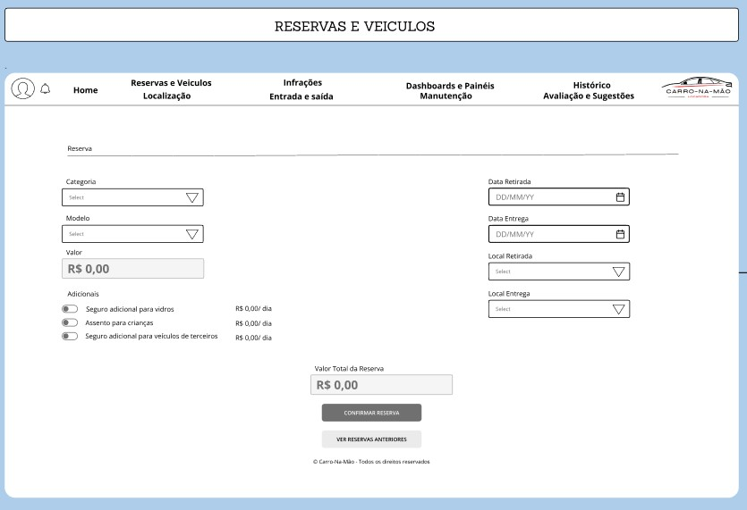

# Projeto de Interface

Pré-requisitos: <a href="2-Especificação do Projeto.md"> Documentação de Especificação</a>

Visão geral da interação do usuário pelas telas do sistema e protótipo interativo das telas com as funcionalidades que fazem parte do sistema (wireframes).

 Apresente as principais interfaces da plataforma. Discuta como ela foi elaborada de forma a atender os requisitos funcionais, não funcionais e histórias de usuário abordados nas <a href="2-Especificação do Projeto.md"> Documentação de Especificação</a>.

## Diagrama de Fluxo

O diagrama apresenta o estudo do fluxo de interação do usuário com o sistema interativo e  muitas vezes sem a necessidade do desenho do design das telas da interface. Isso permite que o design das interações seja bem planejado e gere impacto na qualidade no design do wireframe interativo que será desenvolvido logo em seguida.

O diagrama de fluxo pode ser desenvolvido com “boxes” que possuem internamente a indicação dos principais elementos de interface - tais como menus e acessos - e funcionalidades, tais como editar, pesquisar, filtrar, configurar - e a conexão entre esses boxes a partir do processo de interação. Você pode ver mais explicações e exemplos https://www.lucidchart.com/blog/how-to-make-a-user-flow-diagram.

## Wireframes

Telas propostas na concepção do projeto:

#### Tela de login front-end Mobile.

#### Tela de cadastro front-end Mobile.

#### Tela de localização front-end Mobile.

#### Tela de reservas front-end Mobile.

#### Tela das minhas reservas front-end Mobile.

#### Tela de notificação front-end Mobile.

#### Tela de vistoria front-end Mobile.

#### Tela de avaliação front-end Mobile.

#### Tela de Registro de avaliação front-end Mobile.

#### Tela de login front-end WEB.

#### Tela de cadastro front-end WEB.

#### Tela de estoque front-end WEB.

#### Tela de categoria front-end WEB.

#### Tela de localização front-end WEB.

#### Tela de Reservas front-end WEB.

#### Tela de notificações front-end WEB.

#### Tela de infrações front-end WEB.

#### Tela de vistoria front-end WEB.

#### Tela de manutenção front-end WEB.

#### Tela de Avaliação front-end WEB.

#### Tela de historico front-end WEB.

#### Tela de Dashboard front-end WEB.

OBS.: Etapa em desenvolvimento e constante atualização.
