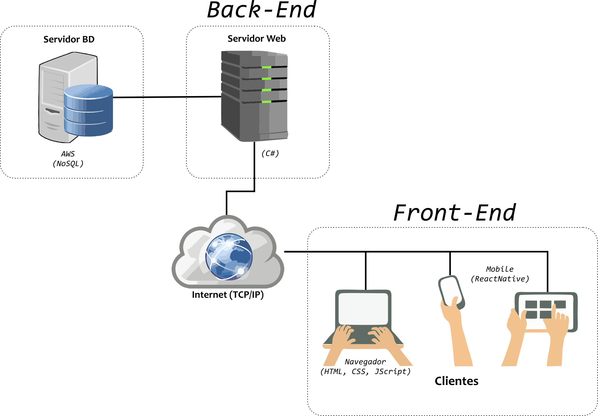
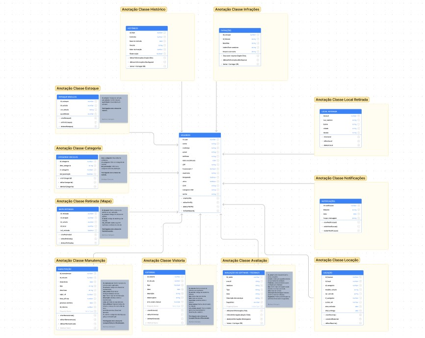
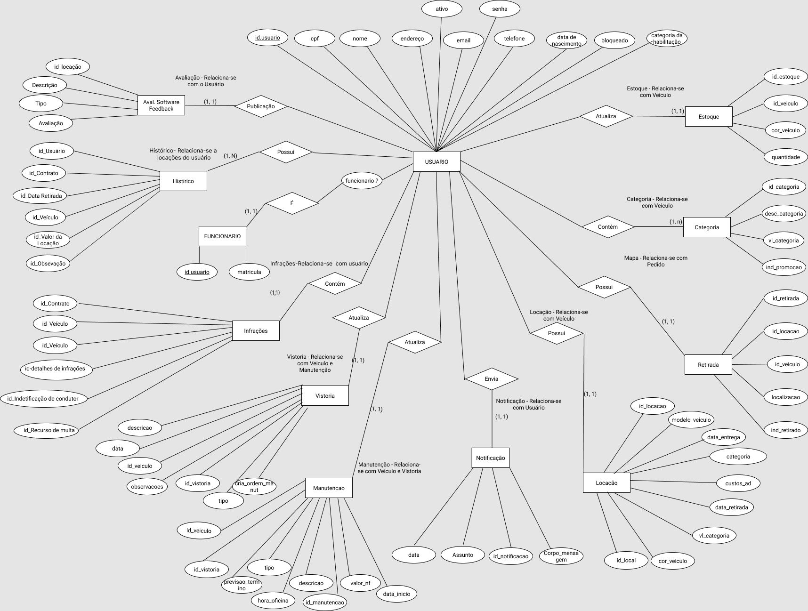
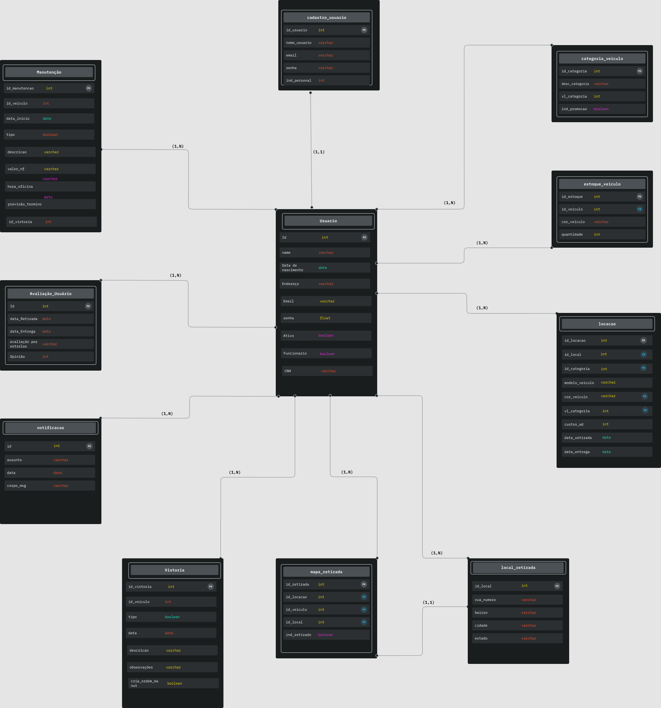

# Arquitetura da Solução

Pré-requisitos: <a href="3-Projeto de Interface.md"> Projeto de Interface</a>

O software será desenvolvido baseado no modelo de arquitetura de sistemas distribuídos.

Em (COLOURIS, 2013) um sistema distribuído é definido “como aquele no qual os componentes de hardware ou software, localizados em computadores interligados em rede, comunicam-se e coordenam suas ações apenas enviando mensagens entre si”. 

Esses computadores podem estar em qualquer distância, separados ou não geograficamente (na "nuvem"), representados pela Figura 1 abaixo.

Figura 1 - Arquitetura de Software Distribuído

## Diagrama de Classes

O diagrama de classes ilustra graficamente como será a estrutura do software, e como cada uma das classes da sua estrutura estarão interligadas. Essas classes servem de modelo para materializar os objetos que executarão na memória.

As referências abaixo irão auxiliá-lo na geração do artefato “Diagrama de Classes”.

## Modelo ER (Projeto Conceitual)

O Modelo ER representa através de um diagrama como as entidades (coisas, objetos) se relacionam entre si na aplicação interativa.

## Esquema Relacional

O Esquema Relacional corresponde à representação dos dados em tabelas juntamente com as restrições de integridade e chave primária.
 
As referências abaixo irão auxiliá-lo na geração do artefato “Esquema Relacional”.

> - [Criando um modelo relacional - Documentação da IBM](https://www.ibm.com/docs/pt-br/cognos-analytics/10.2.2?topic=designer-creating-relational-model)

## Projeto de Base de Dados

O projeto de base de dados corresponde à representação das entidades e relacionamentos identificados no Modelo ER, sem formato de tabelas, com colunas e chaves primárias/estranhas permitidas para representar corretamente as restrições de integridade.

A

## Tecnologias Utilizadas

Para o desenvolvimento do sistema utilizaremos a linguagem C# com o Enty Framework, para a manipulação do banco de dados usaremos o MongoDB. Usaremos o visual studio 2022 para desenvolvimento da aplicação, já para o gerenciamento de código usamos o github.

## Hospedagem

O local de hospedagem ainda está sendo descudida pela equipe, breve disponibilizaremos o link para acesso do Software.

## Qualidade de Software

Conceituar qualidade de fato é uma tarefa complexa, mas ela pode ser vista como um método gerencial que através de procedimentos disseminados por toda a organização, busca garantir um produto final que satisfaça às expectativas dos stakeholders.

No contexto de desenvolvimento de software, qualidade pode ser entendida como um conjunto de características a serem satisfeitas, de modo que o produto de software atenda às necessidades de seus usuários. Entretanto, tal nível de satisfação nem sempre é alcançado de forma espontânea, devendo ser continuamente construído. Assim, a qualidade do produto depende fortemente do seu respectivo processo de desenvolvimento.

A norma internacional ISO/IEC 25010, que é uma atualização da ISO/IEC 9126, define oito características e 30 subcaracterísticas de qualidade para produtos de software.
Com base nessas características e nas respectivas sub-características, identifique as sub-características que sua equipe utilizará como base para nortear o desenvolvimento do projeto de software considerando-se alguns aspectos simples de qualidade. Justifique as subcaracterísticas escolhidas pelo time e elenque as métricas que permitirão a equipe avaliar os objetos de interesse.

> **Links Úteis**:
>
> - [ISO/IEC 25010:2011 - Systems and software engineering — Systems and software Quality Requirements and Evaluation (SQuaRE) — System and software quality models](https://www.iso.org/standard/35733.html/)
> - [Análise sobre a ISO 9126 – NBR 13596](https://www.tiespecialistas.com.br/analise-sobre-iso-9126-nbr-13596/)
> - [Qualidade de Software - Engenharia de Software 29](https://www.devmedia.com.br/qualidade-de-software-engenharia-de-software-29/18209/)
