# Registro de Testes de Software
 ## FRONT END: WEB
  ### 1 - Login/Cadastro

  **1.1 - Verificar se o login barra campos em branco**
 
 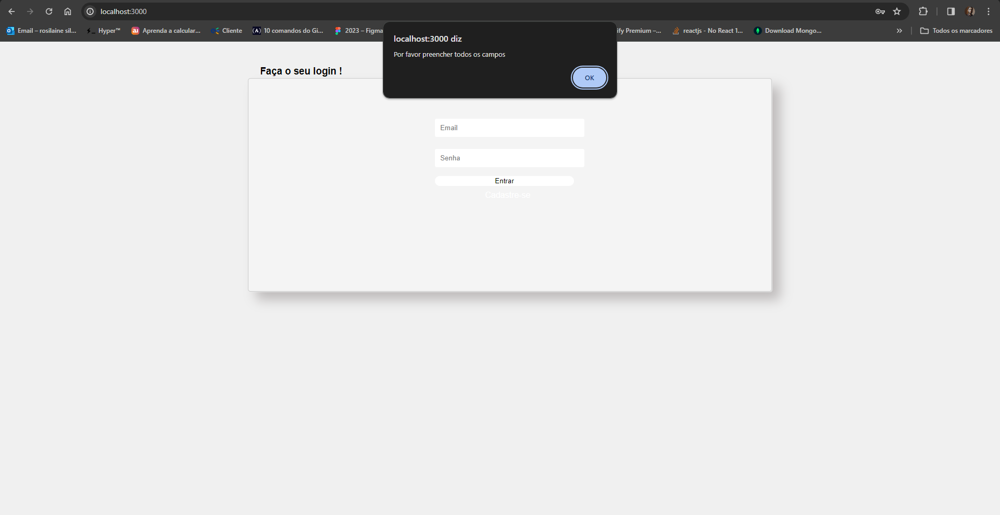

 **1.2 - Verificar se o login barra usuarios não cadastrados**
 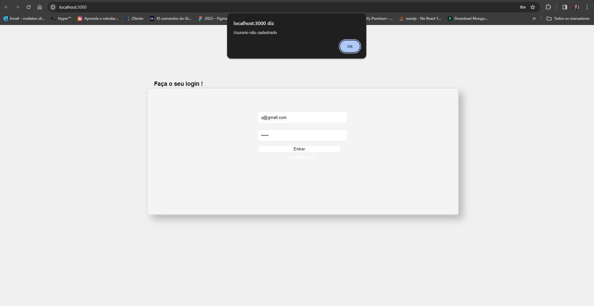
   
 **1.3- Verificar se o cadastro barra campos em branco**
 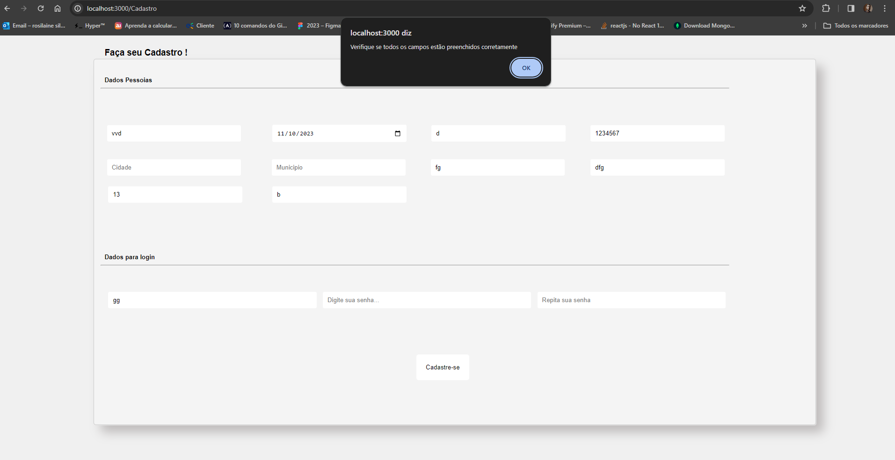

 ### 5- Avaliação
 **5.1 - Registro das Informações**

 **5.1.1 - Teste sem Informações**
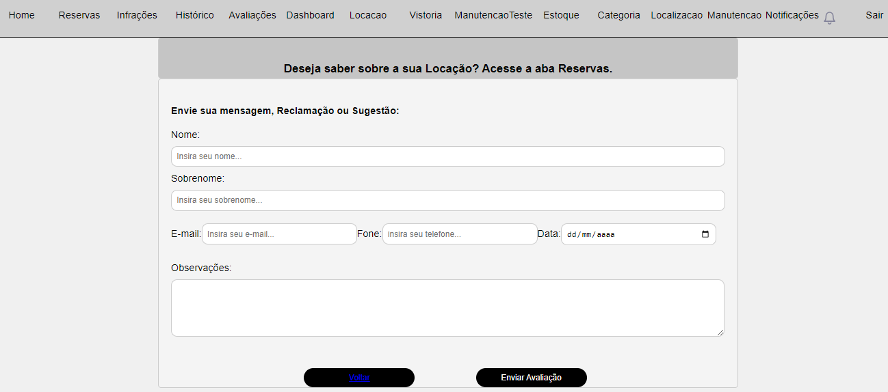
 
 **5.1.2 - Teste com Informações**
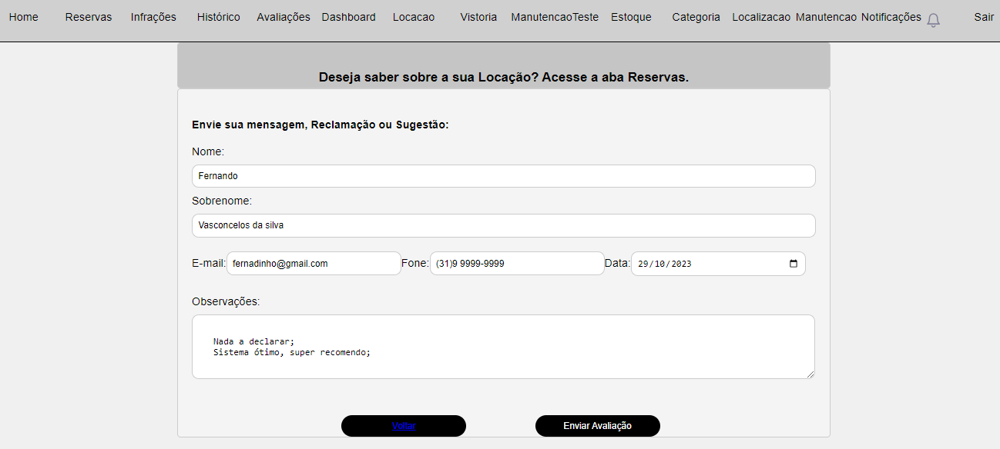

**5.2 - Front End Web em Funcionamento**

 **5.2.1 - Teste de Exeto**
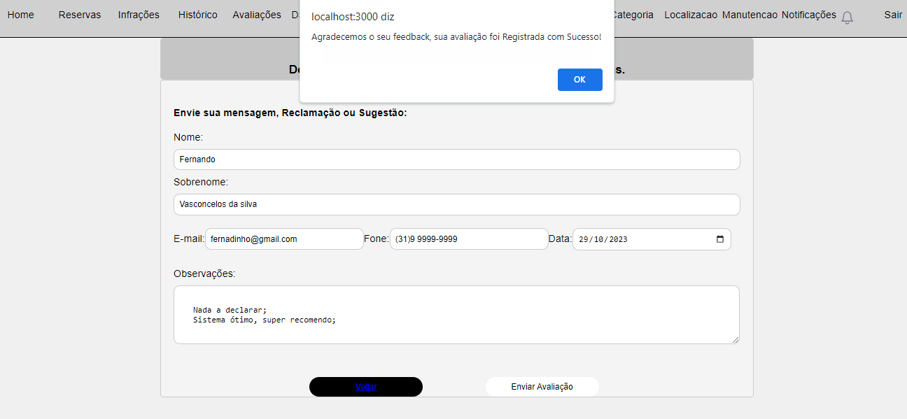

 **5.2.2 - Teste de Erro**
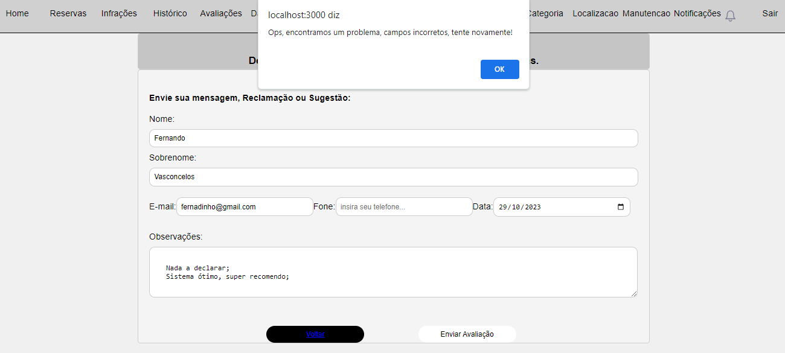

**5.3 - Excluindo Informações Registradas**

 **5.3.1 - Teste de Exclusão**

 ### 6- Locação
 **6.1 - Registro das Informações**

 **6.1.1 - Teste sem Informações**
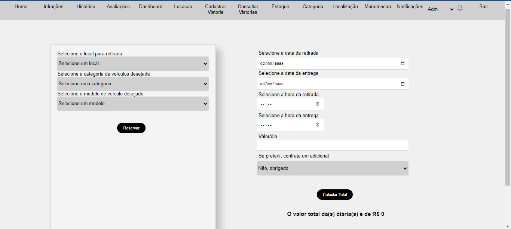
 
 **6.1.2 - Teste com Informações**
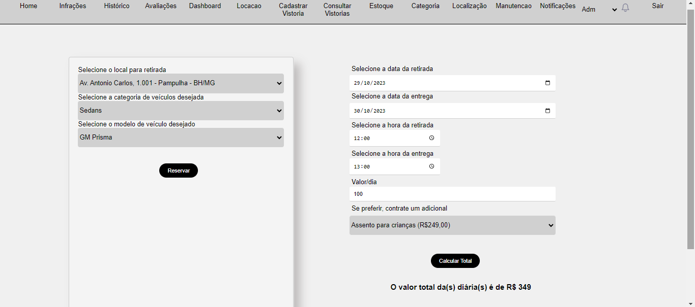

**6.2 - Front End Web em Funcionamento**

 **6.2.1 - Teste de Êxito**
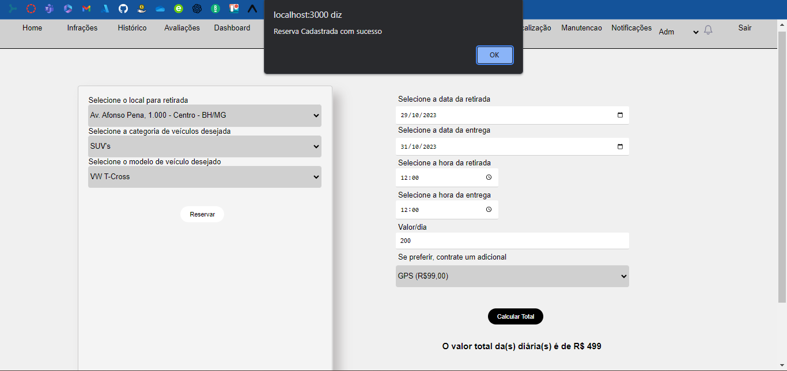

 **6.2.2 - Teste de Erro**
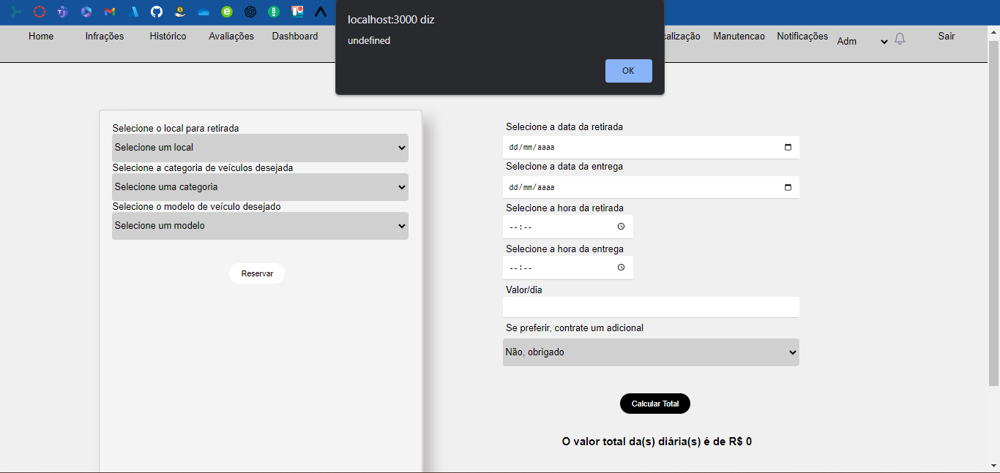

**6.3 - Excluindo Informações Registradas**

 **6.3.1 - Teste de Exclusão**

  ### 9- Notificação
**9.1 - Teste de envio de nova notificação**
 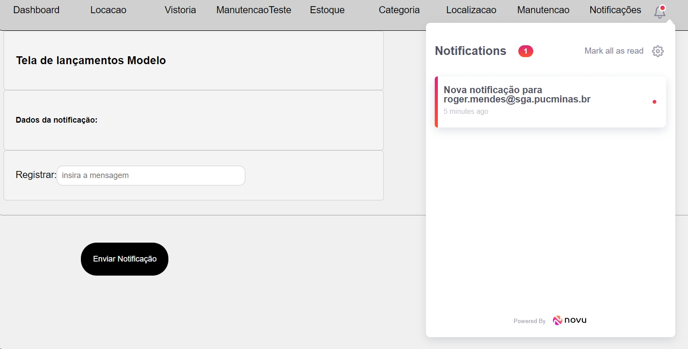

 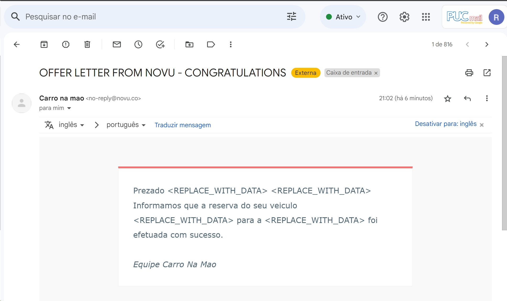

**9.2 - Teste de leitura de nova notificação**
 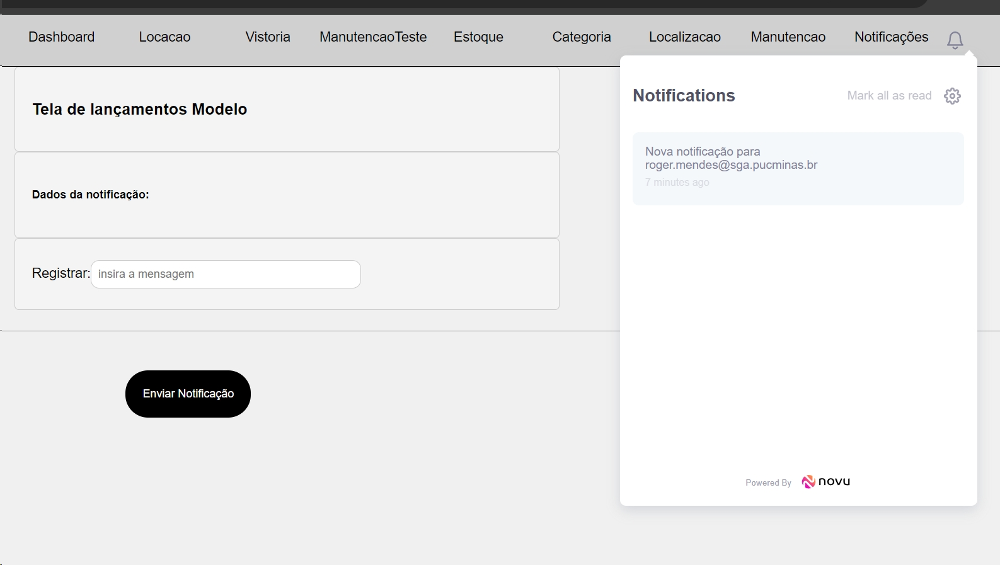
 
 **9.3 - Teste de exclusão de notificação**
 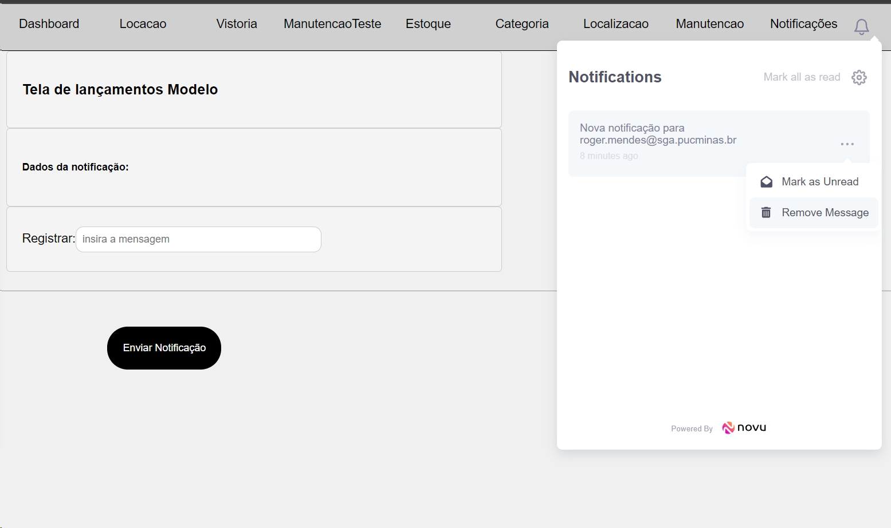

 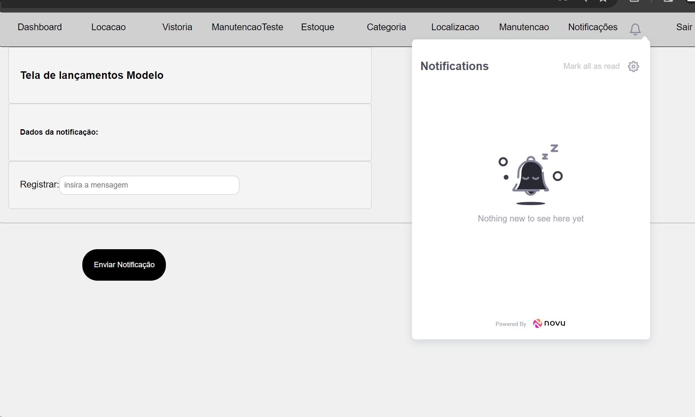

##
## API
### 1- Cadastro 
 **1.1 - Post**

  

 **1.2 - Delete**
  
  
 
**1.3 - Update**
 
  
 
**1.4 - Get**

 

#### 2 - Estoque
**2.1 - Create**

 

**2.2 - Delete**
 
  

**2.3 - Update**

 

**2.4 - Get**

  

### 3- Retirada
**3.1 - Create**

  

**3.2 - Delete**
 
 

**3.3 - Get**

 

  ### 4- Categoria
**4.1 - Create**

 

**4.2 - Delete**

 

 **4.3 - Update**

**4.4 - Get**

 ### 5- Avaliação

**5.1 - Get**

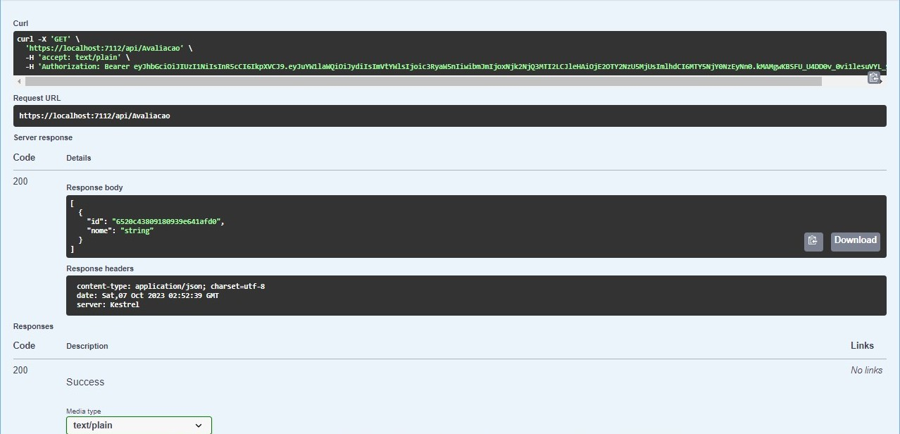

**5.2 - Post**

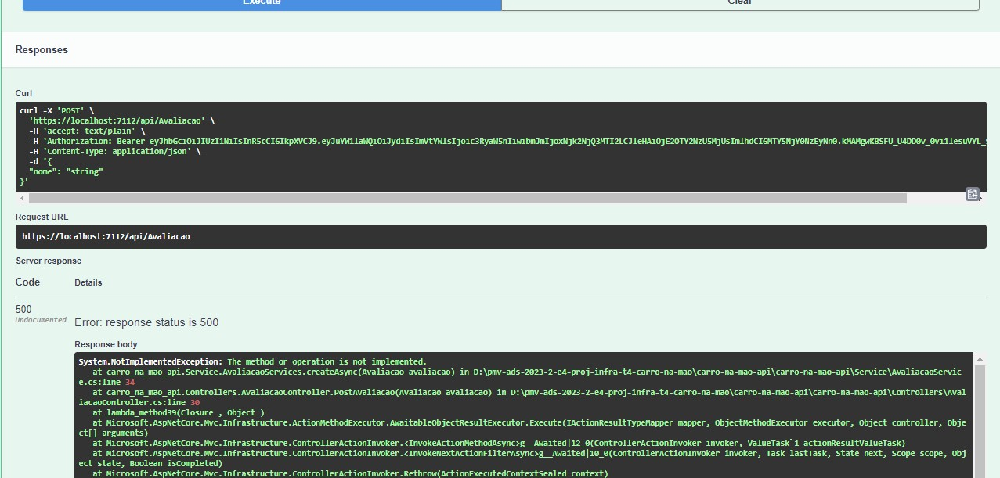

**5.3 - Delete**

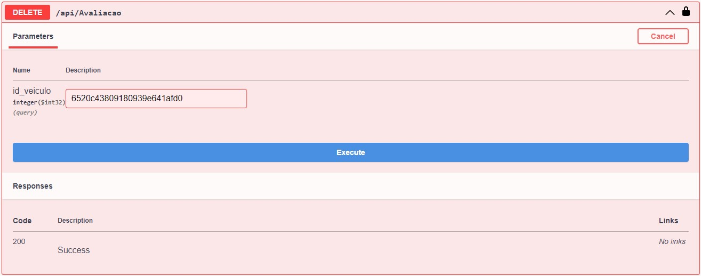

 **5.4 - Update**

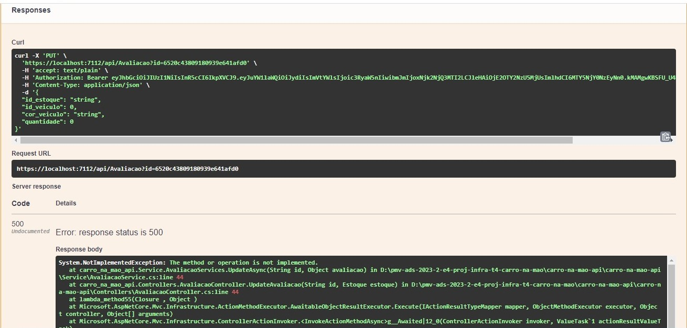

 ### 6- Locação

**6.1 - Get**

**6.2 - Post**

**6.3 - Delete**

  ### 7- Vistorias
**7.1 - Create**

 

**7.2 - Delete**

 

 **7.3 - Update**

**7.4 - Get**

  ### 8- Manutenções
**8.1 - Create**

 

**8.2 - Delete**

 

 **8.3 - Update**

**8.4 - Get**

  ### 9- Notificação
**9.1 - Get**

 

**9.2 - Create**

 

 **9.3 - Delete**

 

   ### 10- Historico
**10.1 - Get**

 

**10.2 - Create**

 

   ### 11-Multa
**11.1 - Get**

 

**11.2 - Create**

 

