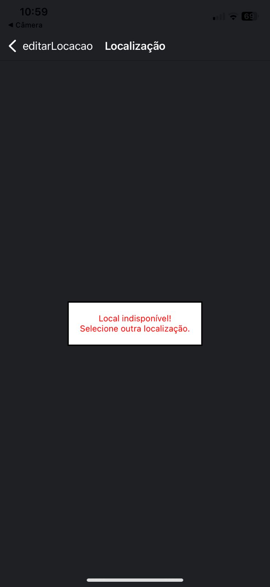

# Registro de Testes de Software
 ## FRONT END: MOBILE
  ### 01- Cadastro/Login

  **1.1 - Verificar se o cadastro email já cadastrado na plataforma**

  

  **1.2 - Verificar se cadastro está sendo realizado sem nenhum problema**

  

  

  **1.3 - Verificar se o  sistema deixa somente usuario cadastrados entrar na plataforma**

  

  ### 02 - Avaliação 
  **2.1 - Verificar se as avaliações estão sendo recuperadas do banco de dados de maneira correta**

  

  ### 03- Locação

  **3.1 - Verificar se as locações são cadastradas corretamente**

  

  

  **3.2 - Verificar se as locações são excluídas corretamente**
  
  

  

  **3.3 - Verificar se as locações aparecem corretamente**

  

  **3.4 - Verificar se as locações são editadas corretamente**

  

### 04 - Vistoria

**4.1 Verificar se os dados selecionados para a vistoria salvam de forma correta**

  

  

  ### 05 - Notificação
  **5.1 - Teste de envio de nova notificação**

  

  

  

  ### 06 - Perfil
  **6.1 - Verificar se as informções do usaurio aparece de acordo com o usuario logado**
  
  

  **6.2 - Verificar se se o usuario consegue editar sua informações**

  

  **6.3 -  Verificar se o usuario consegue apagar sua conta**

  

  

  ### 07- Localização
  **7.1 - Visualizar mapa do local da retirada**

  

  **7.2 - Localização não existente**

  

 ## FRONT END: WEB
  ### 01 - Login/Cadastro

  **1.1 - Verificar se o login barra campos em branco**
 
 

 **1.2 - Verificar se o login barra usuarios não cadastrados**
 
   
 **1.3- Verificar se o cadastro barra campos em branco**
 

  ### 02 - Estoque

  **2.1 - Inserção de novo regristo**
  

  **2.2 - Edição de um regristo**
  

  **2.3 - Carregar informações**
  

  ### 04- Categoria

   **4.1 - Inserção de novo regristo**
   

   **4.2 - Edição de um regristo**
   

   **4.3 - Carregar informações**
   

 ### 05- Avaliação
 **5.1 - Registro das Informações**

 **5.1.1 - Teste sem Informações**

 
 **5.1.2 - Teste com Informações**

**5.2 - Front End Web em Funcionamento**

 **5.2.1 - Teste de Exeto**

 **5.2.2 - Teste de Erro**

**5.3 - Excluindo Informações Registradas**

 **5.3.1 - Teste de Exclusão**

 ### 6- Locação
 **6.1 - Registro das Informações**

 **6.1.1 - Teste sem Informações**

 
 **6.1.2 - Teste com Informações**

**6.2 - Front End Web em Funcionamento**

 **6.2.1 - Teste de Êxito**

 **6.2.2 - Teste de Erro**

**6.3 - Excluindo Informações Registradas**

 **6.3.1 - Teste de Exclusão**

 ### 07- Vistoria
 **7.1 - Registro da vistoria**

 **7.1.1 - Teste sem Informações**

 
 **7.1.2 - Teste com Informações**

**7.2 - Front End Web em Funcionamento**

 **7.2.1 - Teste de Exito**

 **7.2.2 - Teste de Erro**

**7.3 - Excluindo Informações Registradas**

 **7.3.1 - Teste de Exclusão**

  ### 08- Notificação
**8.1 - Teste de envio de nova notificação**
 

 

  ### 09 - Categoria

  **9.1 - Visualização do mapa**
  

##
## API
### 01 - Cadastro 
 **1.1 - Post**

  

 **1.2 - Delete**
  
  
 
**1.3 - Update**
 
  
 
**1.4 - Get**

 

#### 02 - Estoque
**2.1 - Create**

 

**2.2 - Delete**
 
  

**2.3 - Update**

 

**2.4 - Get**

  

### 03- Retirada
**3.1 - Create**

  

**3.2 - Delete**
 
 

**3.3 - Get**

 

  ### 04- Categoria
**4.1 - Create**

 

**4.2 - Delete**

 

 **4.3 - Update**

**4.4 - Get**

 ### 05- Avaliação

**5.1 - Get**

**5.2 - Post**

**5.3 - Delete**

 **5.4 - Update**

 ### 06- Locação

**6.1 - Get**

**6.2 - Post**

**6.3 - Delete**

  ### 07- Vistorias
**7.1 - Create**

 

**7.2 - Delete**

 

 **7.3 - Update**

**7.4 - Get**

### 08- Manutenções
**8.1 - Create**

 

**8.2 - Delete**

 

 **8.3 - Update**

**8.4 - Get**

  ### 9- Notificação
**9.1 - Get**

 

**9.2 - Create**

 

 **9.3 - Delete**

 

  